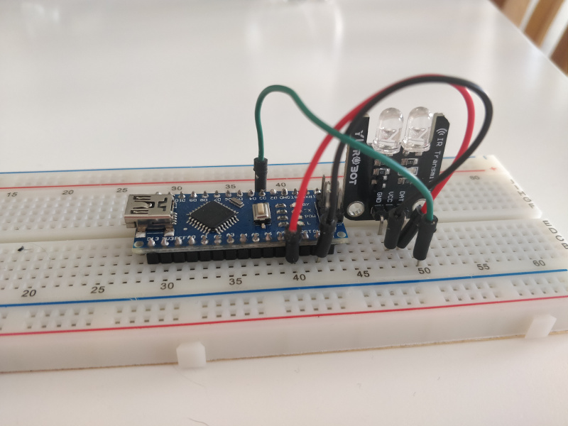

Toshiba AC remote for Arduino
=============================

This code creates a serial API interface device to pass commands to Toshiba air
conditioner / heat pump. This works with my AC model:
Toshiba Heat Pump RAS-10PKVP-ND, which has a IR remote control WH-H07JE.
Program reads commands from serial JSON input, sends them to AC by IR, and
returns ACK status as JSON. IR is one way only, no ACK from AC.

I recorded all the key presses controller sends, and added the protocol to
IRremote library. It is included in folder lib/. You can use modified IRremote
library to create other programs of your own. There are bit-fields for
convenience to ease the command creation in C.

I have programmed Arduino Nano with this, which is connected ATM to RasPi with
USB cable. One could connect module to anything that outputs serial console.
E.g. ESP(8266/32) modules.

Next thing to do is to write small utility to receive MQTT commands within RasPi
and relay those as serial into Arduino, and back.

I used [PlatformIO](https://platformio.org/) to compile this, you can import
this folder to PlatformIO. Remember to add ArduinoJSON library.

Feel free to use and modify, it's GPL, and please PR back any enhancements or
bug fixes you find!

Credits to [IRremote](http://z3t0.github.io/Arduino-IRremote/) and
[ArduinoJSON](https://arduinojson.org) developers for the handy libraries.

Usage
=====

Program waits for JSON input with command data. Possible values are:
* **cmd**:  on | off | swing | hipwr | sleep | vertical | stats
  * **temp**: xx °celcius, where xx=17-30°C
  * **mode**: auto | cool | dry | heat
  * **fan**:  auto | 1 | 2 | 3 | 4 | 5
* **swing**
* **hipwr**
* **sleep**
* **vertical**
* **stats**

Examples to send commands over serial:
* { "cmd":"on", "temp":"23", "mode":"auto", "fan": "auto" }
* { "cmd":"off" }
* { "cmd":"swing" }
* { "cmd":"hipwr" }
* { "cmd":"sleep" }
* { "cmd":"vertical" }
* { "cmd": "stats"}

Program will acknowledge the command by sending it back as received, and will
report status in JSON, e.g:
* { "cmd": "swing", "status": "ok"}
* {"status": "fail", "error":"unknown command"}

BR,
Ilkka Tengvall
